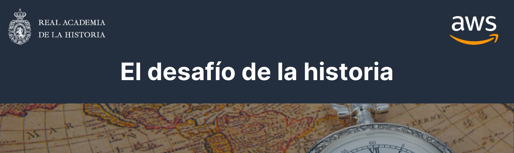

# Alexa Skill - El Desafio de la Historia



Skill implementada para Amazon Alexa en colaboración con Real Academia de la Historia de España y Amazon Web Services utilizando la versión 2.1 de su SDK. Implementación para la distribución en su store en Español, se puede utilizar como template para implementar juegos educativos similares.

## Sobre la Skill

**Nota:** Si estás pensando en desarrollar una nueva Skill en Español y quieres guiarte por este ejemplo, te recomiendo que eches un vistazo al [artículo en medium](https://planetachatbot.com/conversacion-alexa-espanol-6e90ae9401b) que publiqué para iniciarte en modelos de conversación y no tener problemas a la hora de pasar el proceso de certificación de Amazon.

### Uso

```text
Alexa, abre El Desafio de la Historia
	>> Bienvenido jugador, dime tu edad y comencemos el desafío.
```
```text
Alexa, hazme una pregunta al azar
	>> ¿En qué año se firmó la constitución española?.
```

### Repository Contents	

* `/lambda/custom` - Lógica de Back-end para la Skill de Alexa, desplegada en [AWS Lambda](https://aws.amazon.com/lambda/)
* `/models/es-ES.json` - JSON de modelo de interacción para Español (para ser incluído en la consola de desarrollo de la Skill)

### Pre-requisitos para un despliegue

* Node.js (> v4.3)
* Registro en [AWS Account](https://aws.amazon.com/)
* Registro en [Amazon Developer Account](https://developer.amazon.com/)

### Recursos adicionales

* Las librerías utilizadas en el proyecto de back-end son [Request](https://github.com/request/request) para las llamadas al API y la propia [librería de Alexa para Node.js](https://www.npmjs.com/package/ask-sdk) 

## Licencia

    MIT License

    Copyright (c) 2018 Alex Hernández

    Permission is hereby granted, free of charge, to any person obtaining a copy
    of this software and associated documentation files (the "Software"), to deal
    in the Software without restriction, including without limitation the rights
    to use, copy, modify, merge, publish, distribute, sublicense, and/or sell
    copies of the Software, and to permit persons to whom the Software is
    furnished to do so, subject to the following conditions:

    The above copyright notice and this permission notice shall be included in all
    copies or substantial portions of the Software.

    THE SOFTWARE IS PROVIDED "AS IS", WITHOUT WARRANTY OF ANY KIND, EXPRESS OR
    IMPLIED, INCLUDING BUT NOT LIMITED TO THE WARRANTIES OF MERCHANTABILITY,
    FITNESS FOR A PARTICULAR PURPOSE AND NONINFRINGEMENT. IN NO EVENT SHALL THE
    AUTHORS OR COPYRIGHT HOLDERS BE LIABLE FOR ANY CLAIM, DAMAGES OR OTHER
    LIABILITY, WHETHER IN AN ACTION OF CONTRACT, TORT OR OTHERWISE, ARISING FROM,
    OUT OF OR IN CONNECTION WITH THE SOFTWARE OR THE USE OR OTHER DEALINGS IN THE
    SOFTWARE.


